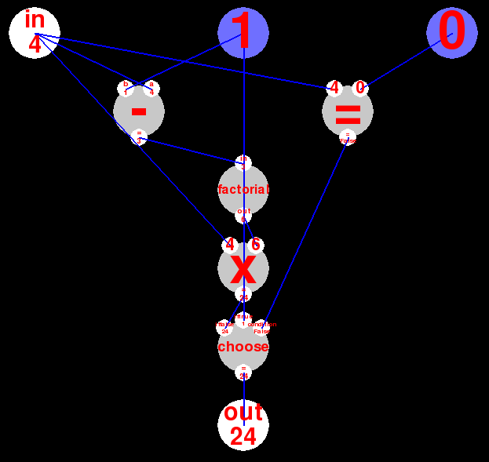

# Visual language experiment

This is an experiment in Visual Programming I made with Eyal Lotem's help at 2007
and [shared with Subtext's mailing list](https://lists.csail.mit.edu/pipermail/subtext/2007-November/000251.html).

It looks something like this:

It is a visual programming demo featuring automatic layout and animations.